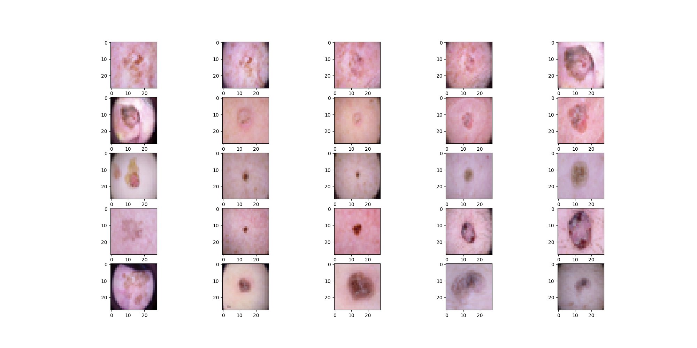
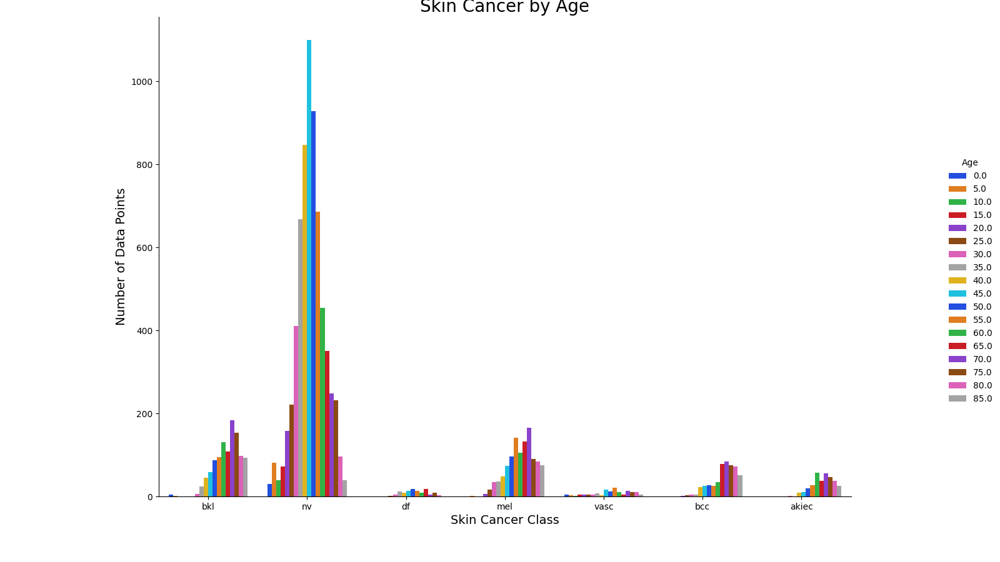
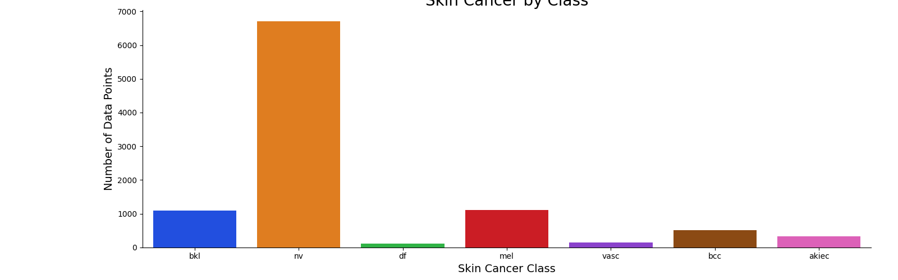
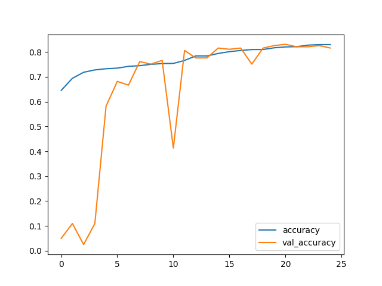

# Skin Pamper

 Developed in Python using keras library, and classified skin lesions using the CNN, trained end-to-end from images directly, using only pixels values.

Just create a venv and pip install the `REQUIREMENTS.txt` file and run the python notebook in the environment.

[Skin Cancer MNIST: HAM10000](https://www.kaggle.com/datasets/kmader/skin-cancer-mnist-ham10000?select=HAM10000_images_part_2) a large collection of multi-source dermatoscopic images of pigmented lesions is available in Kaggle. The  required datasets is directly downloaded into workspace using `wget`. With this two data file we built a sequential CNN model using [tf.keras.Sequential](https://www.tensorflow.org/api_docs/python/tf/keras/Sequential)

`hmnist_28_28_RGB.csv` contains the pixel values and the classification of each image. The following are the 7 types of lesions available in this file

   1) Actinic keratoses
   2) Basal cell carcinoma
   3) Benign keratosis-like lesions
   4) Dermatofibroma
   5) Melanocytic nevi
   6) Melanoma
   7) Vascular lesions

Converting raw pixel data into image

`HAM10000_metadata.csv` contains the metadata about each image in the `hmnist_28_28_RGB.csv` file.

- RangeIndex: 10015 entries, 0 to 10014
- Data columns (total 7 columns):

| # |   Column     |   Non-Null Count|  Dtype    |
|---|--------------|--------------   |  -----    |
| 0 | lesion_id    | 10015 non-null  |  object   |
| 1 | image_id     | 10015 non-null  |  object   |
| 2 | dx           | 10015 non-null  |  object   |
| 3 | dx_type      | 10015 non-null  |  object   |
| 4 | age          | 9958 non-null   |  float64  |
| 5 | sex          | 10015 non-null  |  object   |
| 6 | localization | 10015 non-null  |  object   |

_________________________________________________________________

Plotting Skin Cancer by Age

Plotting Skin Cancer by Class

We can see that the classes df (Dermatofibroma) and vasc (Vascular lesions) have less data. This results in overfitting problem. To overcome this we used image [Data Augmentation](https://www.tensorflow.org/tutorials/images/data_augmentation) techniques

_________________________________________________________________

Now the the Sequential CNN Model with Flatten,Dense,Dropout,BatchNormalization,Conv2D,MaxPooling2D layers is built and optimized with `adam Optimizer`. The following is the model

### Model: "sequential"

| Layer (type)                                  |         Output Shape      |        Param \#   |
|-----------------------------------------------|---------------------------|-------------------|
| conv2d (Conv2D)                               | (None, 27, 27, 64)        |   832             |
| max_pooling2d (MaxPooling2D)                  |(None, 13, 13, 64)         |   0               |
| batch_normalization (BatchNormalization)      |(None, 13, 13, 64)         |    256            |
| conv2d_1 (Conv2D)                             | (None, 12, 12, 512)       |    131584         |
| max_pooling2d_1 (MaxPooling2D)                |(None, 6, 6, 512)          |    0              |
| batch_normalization_1 (BatchNormalization)    |(None, 6, 6, 512)          |    2048           |
| dropout (Dropout)                             |(None, 6, 6, 512)          |     0             |
| conv2d_2 (Conv2D)                             |(None, 5, 5, 1024)         | 2098176           |
| max_pooling2d_2 (MaxPooling                   |(None, 2, 2, 1024)         |    0              |

- Total params: 4,341,319
- Trainable params: 4,336,071
- Non-trainable params: 5,248

_________________________________________________________________

The model is evaluated using recall. After 25 epochs, each of 110 steps, the model is evaluated as follows
 

Model Progress

